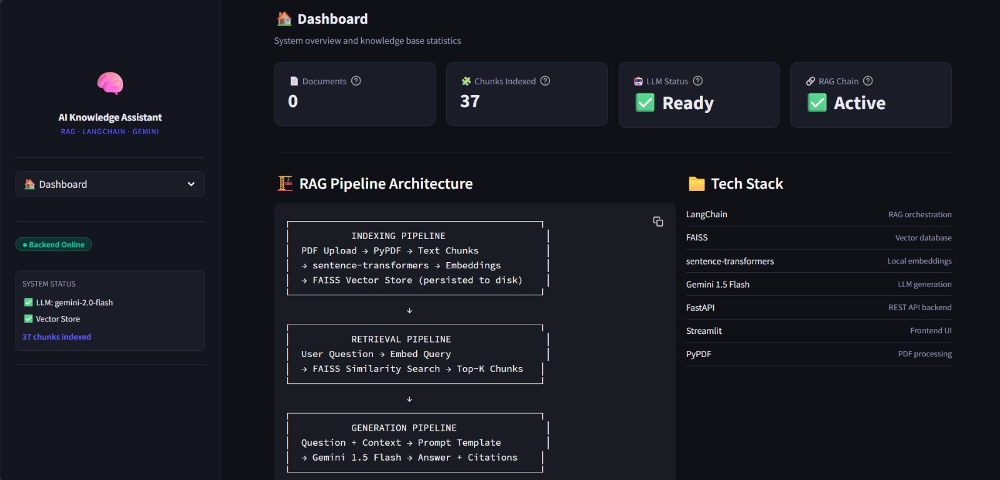
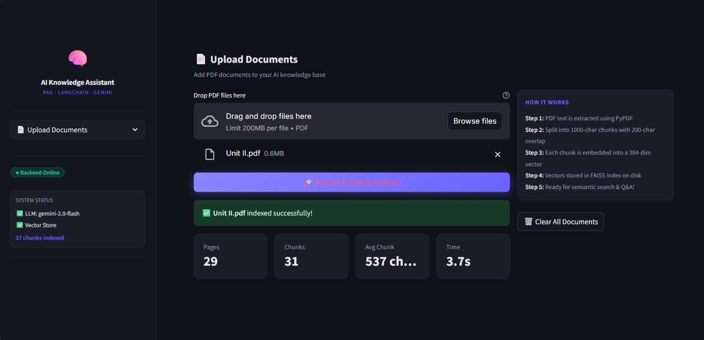
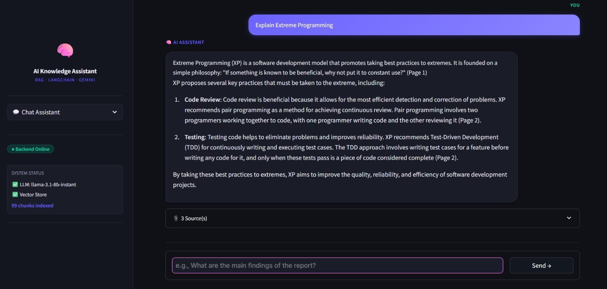

# 🧠 Enterprise AI Knowledge Assistant

A production-style **RAG (Retrieval-Augmented Generation)** powered AI assistant. Upload any PDF and have intelligent, cited conversations with your documents — no hallucination.

---

## 📸 Demo

### Dashboard

### Upload & Index Documents

### AI Chat with Source Citations

---

## 🏗️ How It Works
PDF → PyPDF → Text Chunks → Embeddings → FAISS Vector Store
↓
User Question → Embed → Similarity Search → Top-K Chunks
↓
Chunks + Question → LLaMA3 → Answer + Citations

---

## 🛠️ Tech Stack

| Layer | Technology |
|-------|-----------|
| LLM | LLaMA 3.1 8B via Groq API |
| Embeddings | sentence-transformers (all-MiniLM-L6-v2) |
| Vector Database | FAISS |
| RAG Framework | LangChain |
| Backend API | FastAPI |
| Frontend | Streamlit |
| PDF Processing | PyPDF |

---

## ⚡ Features

- 📄 Upload and index multiple PDF documents
- 🔍 Semantic search using vector embeddings
- 💬 Conversational Q&A with chat memory
- 📎 Source citations with exact page numbers
- 🧠 Context-aware responses grounded in your documents
- 🗄️ Persistent FAISS vector store (survives restarts)
- 🚀 RESTful FastAPI backend
- 🎨 Clean dark-themed Streamlit UI

## 📁 Project Structure
enterprise-ai-assistant/
├── backend/
│   ├── core/
│   │   └── rag_pipeline.py   # RAG pipeline — heart of the project
│   ├── main.py               # FastAPI REST endpoints
│   └── config.py             # Centralized configuration
├── frontend/
│   ├── app.py                # Streamlit UI
│   └── api_client.py         # API client
├── .env.example              # Environment template
├── requirements.txt          # Dependencies
└── README.md
